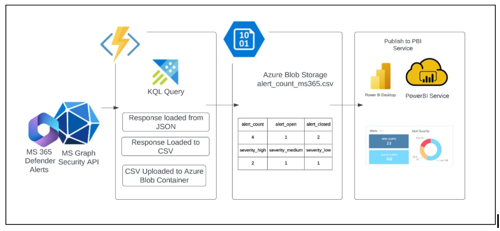

# MS 365 Defender Alerts Dashboard - README

This project provides an architecture for fetching and displaying alerts from MS 365 Defender using the MS Graph Security API, Azure Functions, Azure Blob Storage, and Power BI. The end result is a customizable dashboard that can be used to monitor and analyze the security alerts generated by MS 365 Defender.

## Architecture Overview

The architecture of this project is based on the following steps:

1.  **Fetch alerts from MS 365 Defender:** Use the MS Graph Security API to fetch alerts from MS 365 Defender. This will be triggered using an Azure Function.
    
2.  **Store alerts in CSV format:** The Azure Function will store the response in a CSV file.
    
3.  **Load CSV file to Azure Blob Storage:** The CSV file will be loaded into Azure Blob Storage, where it can be accessed as a data source for Power BI.
    
4.  **Visualize alerts using Power BI:** Use Power BI Desktop to create and publish charts, which can be shared with others via the Power BI Service.
    

## Prerequisites

Before you begin, you will need the following:

-   An Azure subscription
-   A Power BI account
-   MS Graph Security API credentials
-   MS 365 Defender account

## Setup Instructions

1.  Clone this repository to your local machine.
    
2.  Open the repository in Visual Studio Code or your preferred editor.
    
3.  Open the `local.settings.json` file and replace the values for `ClientId`, `ClientSecret`, and `TenantId` with your MS Graph Security API credentials.
    
4.  Deploy the Azure Functions project to your Azure subscription. You can follow the [official Azure Functions deployment guide](https://docs.microsoft.com/en-us/azure/azure-functions/functions-create-first-function-vs-code?pivots=programming-language-csharp).
    
5.  Create an Azure Blob Storage account and container to store the CSV file. You can follow the [official Azure Blob Storage quickstart guide](https://docs.microsoft.com/en-us/azure/storage/blobs/storage-quickstart-blobs-portal).
    
6.  Open Power BI Desktop and create a new report. Use the Azure Blob Storage account as a data source to load the CSV file.
    
7.  Create visualizations and publish the report to Power BI Service.
    

## Conclusion

By following these instructions, you will have set up an architecture to fetch and visualize alerts from MS 365 Defender using MS Graph Security API, Azure Functions, Azure Blob Storage, and Power BI. You can customize the visualizations and share the report with others to create a powerful security monitoring tool.